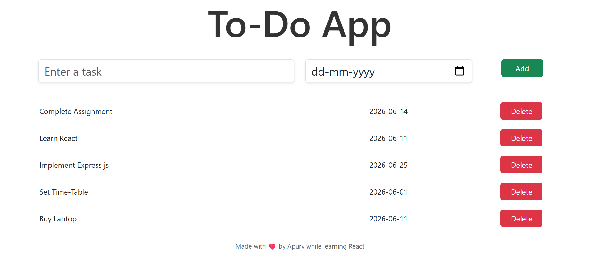

# 📝 Elegant React To-Do Application

[](https://react.dev/)
[](https://vitejs.dev/)
[](https://getbootstrap.com/)
[](https://opensource.org/licenses/MIT)

A modern, responsive, and minimalist To-Do application built with **React**, **Vite**, and **Bootstrap**. This app is designed to help users manage their daily tasks seamlessly with a lightweight and intuitive user interface.

---

## 📷 Application Preview

Below is a preview of the To-Do application showing the interactive UI, task listing, and clean layout:



---

## ✨ Key Features

- **🚀 Lightning Fast Build**: Powered by Vite for near-instant hot module replacement (HMR) and optimized build times.
- **🎨 Modern & Responsive Design**: Styled using a combination of Bootstrap 5 grid systems and clean custom CSS styles.
- **➕ Dynamic Task Management**: Add tasks with dedicated names and set their specific due dates.
- **❌ Quick Delete**: Easily remove tasks when they are completed.
- **📱 Responsive Layout**: Optimised for both mobile devices and desktop screens.
- **❤️ Developer Friendly**: Clean folder structure and separation of components.

---

## 🛠️ Technology Stack

- **Frontend Framework:** React (Hooks: `useState`)
- **Build Tool:** Vite
- **Styling Libraries:** Bootstrap 5 (CSS), Custom CSS
- **Platform/Runtime:** Node.js

---

## 📂 Project Structure

Here is an overview of the key files and directory structure of the application:

```text
To-Do-App/
├── public/                 # Static assets (Favicons, SVG Icons)
├── src/
│   ├── assets/             # Images, screenshots, and visual media
│   │   └── screenshot.png  # Application screenshot
│   ├── components/         # Reusable React components
│   │   ├── AddToDo.jsx     # Component to display individual To-Do tasks
│   │   └── AppName.jsx     # Component for displaying the App Header
│   ├── App.css             # Main stylesheet for custom design overrides
│   ├── App.jsx             # Root React component managing app state
│   └── main.jsx            # Entry point for React application
├── index.html              # HTML template entry
├── package.json            # Scripts, dependencies, and metadata
└── vite.config.js          # Vite configuration settings
```

---

## 🚀 Getting Started

Follow these step-by-step instructions to clone the project, install dependencies, and run the development server locally.

### Prerequisites

Make sure you have [Node.js](https://nodejs.org/) installed (recommended version: 18.x or above) along with npm (comes bundled with Node.js).

### Installation & Setup

1. **Clone the repository:**
   ```bash
   git clone https://github.com/apurvmusandi/ToDo-App.git
   ```

2. **Navigate into the directory:**
   ```bash
   cd ToDo-App
   ```

3. **Install the dependencies:**
   ```bash
   npm install
   ```

4. **Launch the development server:**
   ```bash
   npm run dev
   ```

5. **Open in browser:**
   Open your browser and navigate to `http://localhost:5173` (or the port specified in your console).

---

## 🏗️ Production Build

To generate the optimized production assets:

1. **Build the production bundle:**
   ```bash
   npm run build
   ```
   *This outputs static files to the `/dist` directory.*

2. **Preview the production build locally:**
   ```bash
   npm run preview
   ```

---

## 📝 How to Use the App

1. **Create a Task:**
   - Enter your task description in the **"Enter a task"** input box.
   - Choose a due date using the date picker.
   - Click the **Add** button.
2. **Complete / Delete a Task:**
   - Review your task list.
   - Click the **Delete** button next to any task to remove it from the list.

---

## 🤝 Contributing

Contributions, issues, and feature requests are welcome! Feel free to check the [issues page](https://github.com/apurvmusandi/ToDo-App/issues).

---

## 📄 License

This project is licensed under the **MIT License**. Feel free to use and adapt it for your own learning or personal projects.

---

*Made with ❤️ by Apurv while learning React.*
